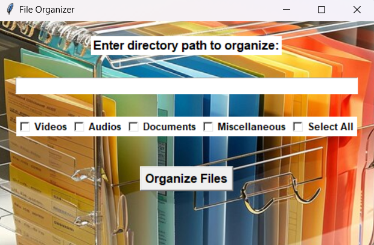
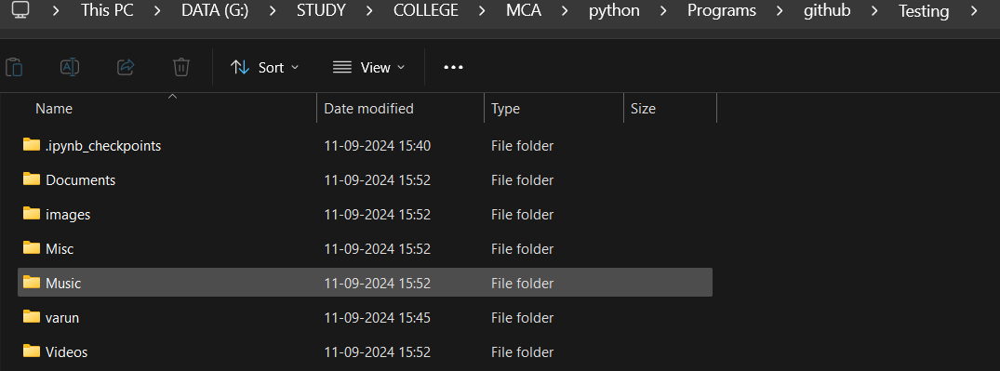

# File Organizer Application - User Manual

Effortlessly organize your files into appropriate folders with the File Organizer application.

---

## Prerequisites & Requirements

Before you begin, make sure you have the following installed:

- *Python 3.x* or higher
- *Libraries:*
    - tkinter
    - pillow

---

## Features

The File Organizer offers the following key features:

- *Automatic File Sorting*: Sorts files into categories like Videos, Audios, Documents, and more.
- *Customizable Folder Creation*: Automatically creates folders for each file type in the specified directory.
- *Supports Multiple File Formats*: Supports common file extensions for various media types such as videos, audios, and documents.
- *Cross-Platform Support*: Compatible with both Windows and Linux operating systems.

---

## Installation Steps

Follow these steps to get the File Organizer application running:

1. *Step 1:* Clone or download the repository to your local machine.

    bash
    git clone https://github.com/your-username/file-organizer.git
    

2. *Step 2:* Navigate to the project directory.

    bash
    cd file-organizer
    

3. *Step 3:* (Optional but recommended) Create a virtual environment.

    bash
    python -m venv venv
    

4. *Step 4:* Activate the virtual environment:
    - *Windows:*

        bash
        venv\Scripts\activate
        

    - *Linux/macOS:*

        bash
        source venv/bin/activate
        

5. *Step 5:* Install the required dependencies.

    bash
    pip install -r requirements.txt
    

6. *Step 6:* Run the application.

    bash
    python file_organizer.py
    

---

## How to Use the File Organizer

Once the application is set up, follow these steps to organize your files:

1. *Step 1:* Open the application by running the Python script.
2. *Step 2:* In the application window, enter the directory path where the files are located.
3. *Step 3:* Select the file categories you want to organize (Videos, Audios, Documents, etc.).
4. *Step 4:* Click the "Organize Files" button to move files into appropriate folders based on their type.

---

## Screenshots

Here are some screenshots of the File Organizer in action:

    
    

---

## Troubleshooting

If you encounter any issues, here are some common solutions:

- *Problem:* "ModuleNotFoundError" or missing libraries.
  - *Solution:* Install missing dependencies using:

    bash
    pip install -r requirements.txt
    

- *Problem:* The application doesn’t recognize certain file formats.
  - *Solution:* Check if the file extension is supported. The current version supports common video, audio, and document file types.

---

## Contact Support

If you need additional help, feel free to contact us:

- *Email:* [support@fileorganizerapp.com](mailto:support@fileorganizerapp.com)
- *GitHub Repository:* [https://github.com/VARUNs2196/file-organizer](https://github.com/VARUNs2196/file-organizer)

We are happy to assist you with any questions or issues you may have!

---

&copy; 2024 File Organizer Application | All Rights Reserved
